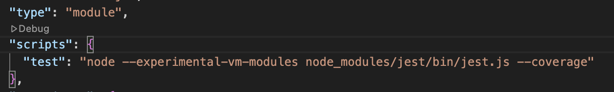

# Jest

Documentación oficial: [Jest](https://jestjs.io/) 

## Requisitos

- [Node Instalado](https://nodejs.org/es) (Versión mayor a la v18.8.0)

# Setup

## 1. Inicializar un proyecto de node.

En caso de no tenerlo, inicializar un proyecto de Node con el comando `npm init -y`. Se deberá crear el arhcivo `package.json`

## 2. Instalar la dependencia de Jest:
`npm install --save-dev jest`
> --save-dev hace que no haya herramientas de desarrollo innecesarias en el entorno final.

## 3. Agregar el script al package.json:
```
"scripts": {
  "test": "jest"
}
```

Observar que ocurre cuando se ejecuta `npm run test`

## 4. Configurar el soporte para Módulos ES6:

Como estamos usando ES6, para importar modulos, se debe usar la palabra reservada import. Jest soporta una versión experimental de ES6, por lo que al intentar ejecutar los tests simplemente con "jest", no va a funcionar. Para que funcione, se debe modificar el contenido del script "test" por el siguiente:

`node --experimental-vm-modules node_modules/jest/bin/jest.js`

Además se deberá agregar en el archivo package.json la siguiente línea de código:
`"type": "module"`

El `package.json` debería quedar similar a esto:


[Documentación: Jest y ECMAScript Modules](https://jestjs.io/docs/ecmascript-modules)

## 5. Modificar el comando para mostrar el coverage:

Agregar la flag `--coverage` al script para obtener el reporte de coverage

# Ejemplo: 

Implementar tests unitarios para la clase Calculator y Country

# Documentación:

## Getting started (Config para JS Y TS):
[Getting started](https://jestjs.io/docs/getting-started)

## Matchers:
[Matchers](https://jestjs.io/docs/using-matchers)

## Setup/Teardown
[Setup and teardown](https://jestjs.io/docs/setup-teardown)
